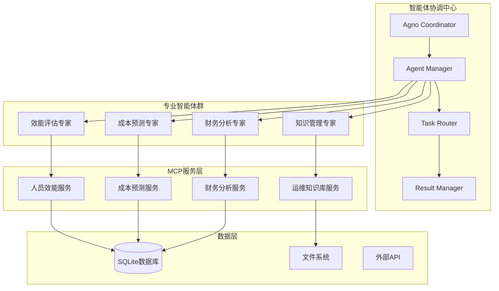
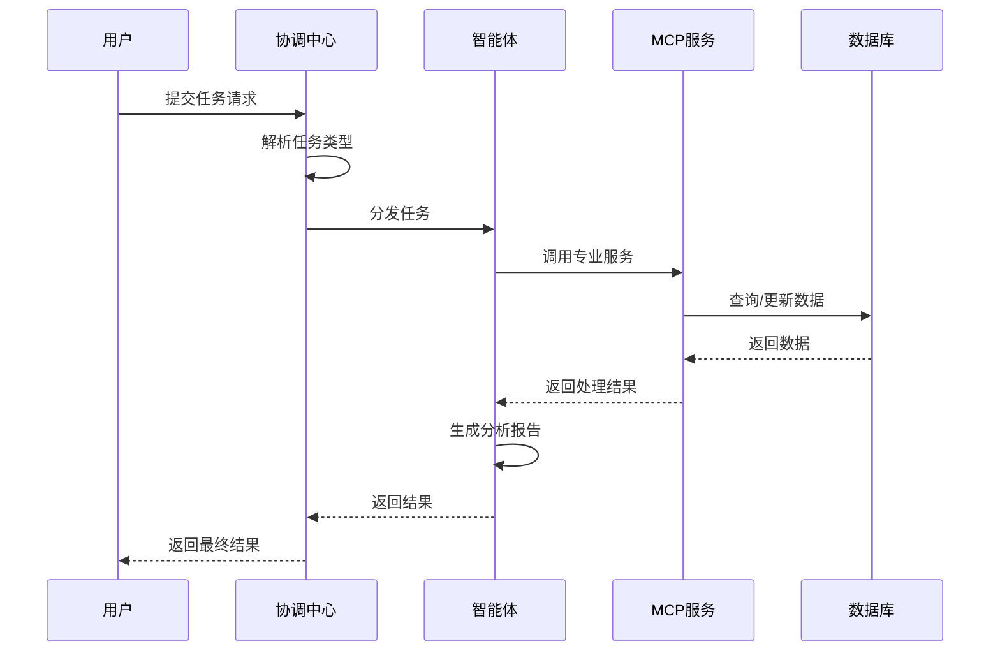

# 四川智水AI智慧管理解决方案 - 智能体协调中心架构说明

## 系统概述

智能体协调中心（Agno Coordinator）是四川智水AI智慧管理解决方案的核心组件，负责协调和管理多个专业智能体，解决企业在项目管理、财务分析、运维知识管理等方面的痛点。

## 核心业务价值

### 解决的企业痛点
1. **数据分散问题** - 通过智能体协调统一数据处理
2. **财务能力不足** - 提供AI驱动的财务分析智能体
3. **运维知识分散** - 建立统一的知识管理智能体
4. **成本不透明** - 实现智能化的成本预测和分析
5. **系统割裂** - 通过智能体协作实现系统整合

## 技术架构

### 整体架构图


### 核心组件说明

#### 1. 智能体协调中心 (Agno Coordinator)
- **功能**: 统一管理和协调所有智能体
- **技术**: Python + Agno框架
- **职责**: 任务分发、结果汇总、智能体间协作

#### 2. 专业智能体群
- **效能评估专家** (EfficiencyAgent): 分析人员效能和项目绩效
- **成本预测专家** (CostAgent): 预测项目成本和资源需求
- **财务分析专家** (FinancialAgent): 提供财务洞察和建议
- **知识管理专家** (KnowledgeAgent): 管理运维知识库

#### 3. MCP服务层
- **人员效能服务**: 处理人员数据分析
- **成本预测服务**: 执行成本计算和预测
- **财务分析服务**: 提供财务数据处理
- **运维知识库服务**: 管理技术文档和知识

## 数据流架构

### 任务处理流程


### 数据结构定义

#### AgentTask (任务对象)
```python
@dataclass
class AgentTask:
    task_id: str              # 任务唯一标识
    task_type: str            # 任务类型
    input_data: Dict[str, Any] # 输入数据
    user_id: Optional[str]    # 用户ID
    priority: str             # 优先级 (low/normal/high)
    created_at: datetime      # 创建时间
```

#### AgentResult (结果对象)
```python
@dataclass
class AgentResult:
    task_id: str              # 对应任务ID
    agent_id: str             # 智能体ID
    status: str               # 状态 (success/error/partial)
    result_data: Dict[str, Any] # 结果数据
    confidence_score: float   # 置信度分数
    recommendations: List[str] # 建议列表
    error_message: Optional[str] # 错误信息
    processing_time: float    # 处理时间
    created_at: datetime      # 创建时间
```

## 智能体详细说明

### 1. 效能评估专家 (EfficiencyAgent)
- **MCP服务**: 人员效能服务 (端口8080)
- **核心功能**: 
  - 员工绩效分析
  - 项目效率评估
  - 资源利用率分析
- **输入数据**: 员工数据、项目数据、时间记录
- **输出结果**: 效能报告、改进建议

### 2. 成本预测专家 (CostAgent)
- **MCP服务**: 成本预测服务
- **核心功能**:
  - 项目成本预测
  - 资源成本分析
  - 预算偏差分析
- **输入数据**: 项目规模、资源需求、历史成本
- **输出结果**: 成本预测、风险评估

### 3. 财务分析专家 (FinancialAgent)
- **MCP服务**: 财务分析服务
- **核心功能**:
  - 财务数据分析
  - 盈利能力评估
  - 现金流预测
- **输入数据**: 财务报表、项目收支、市场数据
- **输出结果**: 财务洞察、投资建议

### 4. 知识管理专家 (KnowledgeAgent)
- **MCP服务**: 运维知识库服务
- **核心功能**:
  - 技术文档管理
  - 问题解决方案检索
  - 知识库维护
- **输入数据**: 技术问题、文档内容、经验总结
- **输出结果**: 解决方案、最佳实践

## 配置管理

### AI模型配置
```python
AI_CONFIG = {
    "api_key": "",
    "api_base": "https://xi.apicenter.top/v1",
    "model": "gemini-2.5-pro",
    "temperature": 0.7
}
```

### MCP服务配置
```python
MCP_SERVICES_CONFIG = {
    "人员效能": MCPServiceConfig(
        name="人员效能",
        command=["python", "main.py"],
        cwd="5_hr_efficiency_mcp",
        env={}
    ),
    # 其他服务配置...
}
```

## 部署和运行

### 启动顺序
1. 启动各个MCP服务
2. 启动智能体协调中心
3. 运行集成测试验证

### 运行命令
```bash
# 启动协调中心
cd 7_agno_coordinator
python start_optimized.py

# 运行集成测试
python test_agents_integration.py
```

## 监控和日志

### 日志级别
- **INFO**: 正常操作日志
- **WARNING**: 警告信息
- **ERROR**: 错误信息
- **DEBUG**: 调试信息

### 监控指标
- 智能体响应时间
- MCP服务连接状态
- 任务处理成功率
- 系统资源使用情况

## 扩展性设计

### 新增智能体
1. 继承BusinessAgent基类
2. 实现必要的抽象方法
3. 配置对应的MCP服务
4. 注册到智能体管理器

### 新增MCP服务
1. 实现MCP协议接口
2. 添加服务配置
3. 更新智能体绑定
4. 测试服务连接

## 安全考虑

### 数据安全
- API密钥通过环境变量管理
- 敏感数据加密存储
- 访问权限控制

### 系统安全
- 输入数据验证
- 异常处理机制
- 日志脱敏处理

## 性能优化

### 缓存策略
- 智能体结果缓存
- MCP服务连接池
- 数据查询缓存

### 并发处理
- 异步任务处理
- 智能体并行执行
- 资源池管理

## 故障恢复

### 容错机制
- 智能体重试机制
- MCP服务自动重连
- 任务队列持久化

### 监控告警
- 服务健康检查
- 异常自动告警
- 性能指标监控