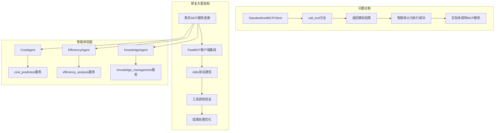
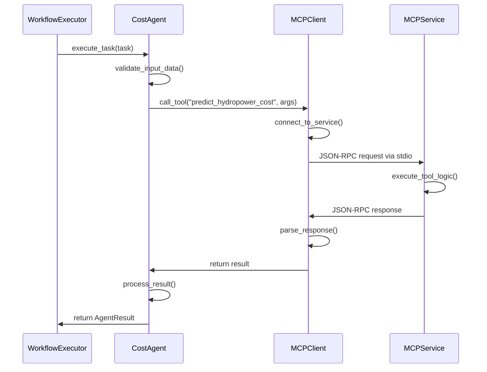

# 智能体执行问题修复方案设计 (DESIGN)

## 整体架构图



## 分层设计

### 1. MCP客户端层 (修复核心)
**当前问题**：StandardizedMCPClient只返回模拟结果
**修复方案**：实现真实的MCP服务连接和调用

#### 设计原则
- 保持现有接口兼容性
- 实现真实的stdio MCP协议通信
- 添加连接健康检查和重试机制
- 优化错误处理和日志记录

#### 核心组件
```python
class StandardizedMCPClient:
    def __init__(self, service_name: str, service_path: str)
    def connect_to_service(self) -> bool
    def call_tool(self, tool_name: str, arguments: dict) -> dict
    def check_service_health(self) -> bool
    def disconnect(self) -> None
```

### 2. 智能体业务层 (保持不变)
**现状**：BusinessAgent基类和三个专业智能体实现完善
**策略**：保持现有业务逻辑不变，只修复MCP调用部分

#### 智能体映射
- **CostAgent** → cost_prediction MCP服务
- **EfficiencyAgent** → efficiency_analysis MCP服务  
- **KnowledgeAgent** → knowledge_management MCP服务

### 3. 工作流协调层 (保持不变)
**现状**：start_optimized.py的工作流执行逻辑正常
**策略**：保持现有并行执行和异常处理机制

## 核心组件设计

### 1. MCP服务连接管理器
```python
class MCPServiceManager:
    """MCP服务连接管理器"""
    
    def __init__(self):
        self.services = {}  # 服务连接池
        self.health_status = {}  # 服务健康状态
    
    def register_service(self, service_name: str, service_path: str) -> bool
    def get_client(self, service_name: str) -> StandardizedMCPClient
    def check_all_services_health(self) -> dict
    def cleanup_all_connections(self) -> None
```

### 2. 真实MCP客户端实现
```python
class StandardizedMCPClient:
    """真实的MCP客户端实现"""
    
    def __init__(self, service_name: str, service_path: str):
        self.service_name = service_name
        self.service_path = service_path
        self.process = None
        self.connected = False
    
    def connect_to_service(self) -> bool:
        """启动MCP服务进程并建立stdio连接"""
        
    def call_tool(self, tool_name: str, arguments: dict) -> dict:
        """真实的工具调用实现"""
        
    def _send_request(self, request: dict) -> dict:
        """发送JSON-RPC请求到MCP服务"""
        
    def _handle_response(self, response: dict) -> dict:
        """处理MCP服务响应"""
```

### 3. 错误处理和重试机制
```python
class MCPErrorHandler:
    """MCP错误处理器"""
    
    @staticmethod
    def retry_with_backoff(func, max_retries=3, base_delay=1.0):
        """指数退避重试机制"""
        
    @staticmethod
    def handle_connection_error(error: Exception, service_name: str):
        """连接错误处理"""
        
    @staticmethod
    def handle_tool_call_error(error: Exception, tool_name: str):
        """工具调用错误处理"""
```

## 接口契约定义

### 1. MCP客户端接口
```python
# 输入契约
def call_tool(self, tool_name: str, arguments: Dict[str, Any] = None) -> Dict[str, Any]:
    """
    Args:
        tool_name: MCP工具名称 (如: "predict_hydropower_cost")
        arguments: 工具参数字典
    
    Returns:
        {
            "status": "success" | "error",
            "result": Any,  # 工具执行结果
            "error": str,   # 错误信息(如果有)
            "tool_name": str,
            "timestamp": str
        }
    """
```

### 2. 服务健康检查接口
```python
def check_service_health(self) -> Dict[str, Any]:
    """
    Returns:
        {
            "service_name": str,
            "status": "healthy" | "unhealthy" | "unknown",
            "last_check": str,
            "error_message": str | None,
            "available_tools": List[str]
        }
    """
```

## 数据流向图



## 异常处理策略

### 1. 连接级异常
- **服务未启动**：自动启动MCP服务进程
- **连接超时**：重试连接，最多3次
- **进程崩溃**：重启服务进程，记录错误日志

### 2. 调用级异常
- **工具不存在**：返回明确错误信息，不重试
- **参数错误**：验证参数格式，返回详细错误
- **执行超时**：设置合理超时时间，超时后终止调用

### 3. 数据级异常
- **响应格式错误**：尝试解析，失败则返回原始响应
- **结果验证失败**：记录警告，返回部分结果
- **编码问题**：统一使用UTF-8编码处理

## 性能优化设计

### 1. 连接池管理
- 复用MCP服务连接，避免频繁启停
- 实现连接超时和自动清理机制
- 支持并发调用的线程安全

### 2. 缓存策略
- 缓存服务健康检查结果(30秒有效期)
- 缓存工具列表信息(避免重复查询)
- 实现智能缓存失效机制

### 3. 并发优化
- 支持多个智能体并发调用MCP服务
- 实现请求队列和限流机制
- 优化JSON序列化/反序列化性能

## 集成方案

### 1. 向后兼容
- 保持StandardizedMCPClient的公共接口不变
- 现有智能体代码无需修改
- 工作流执行逻辑保持不变

### 2. 渐进式部署
1. **阶段1**：修复StandardizedMCPClient的call_tool方法
2. **阶段2**：添加真实的MCP服务连接逻辑
3. **阶段3**：优化错误处理和重试机制
4. **阶段4**：性能优化和监控完善

### 3. 测试策略
- 单元测试：MCP客户端的各个方法
- 集成测试：智能体与MCP服务的端到端调用
- 并发测试：多智能体并行执行场景
- 故障测试：服务异常和网络中断场景

## 监控和日志

### 1. 日志增强
```python
# MCP调用日志
logger.info(f"MCP调用开始: {service_name}.{tool_name}")
logger.debug(f"MCP请求参数: {arguments}")
logger.info(f"MCP调用完成: 耗时{duration}ms, 状态{status}")

# 错误日志
logger.error(f"MCP调用失败: {service_name}.{tool_name}, 错误: {error}")
logger.warning(f"MCP服务健康检查失败: {service_name}")
```

### 2. 性能监控
- 记录每次MCP调用的耗时
- 统计服务可用性和成功率
- 监控并发调用的队列长度

### 3. 健康检查
- 定期检查MCP服务状态
- 自动重启异常的服务进程
- 提供服务状态查询接口

---

**设计状态**：已完成 ✅  
**下一阶段**：Atomize - 将修复方案拆分为原子任务  
**创建时间**：2025-01-27  
**架构师**：AI助手