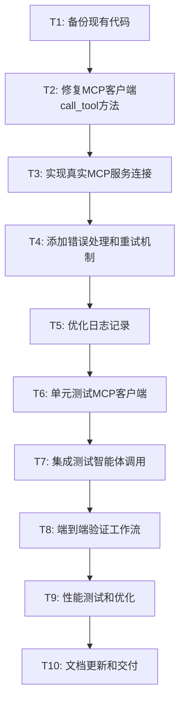

# 智能体执行问题修复任务分解 (TASK)

## 任务依赖图

## 原子任务详细定义

### T1: 备份现有代码
**任务ID**: backup_existing_code  
**优先级**: 高  
**预估时间**: 5分钟  

#### 输入契约
- **前置依赖**: 无
- **输入数据**: 当前项目代码状态
- **环境依赖**: 文件系统访问权限

#### 输出契约
- **输出数据**: 备份文件列表
- **交付物**: 
  - `standardized_mcp_client_v2.py.backup`
  - `business_agent.py.backup`
- **验收标准**: 备份文件创建成功，内容与原文件一致

#### 实现约束
- 使用简单的文件复制，添加`.backup`后缀
- 记录备份时间戳
- 确保备份文件可读

#### 依赖关系
- **后置任务**: T2
- **并行任务**: 无

---

### T2: 修复MCP客户端call_tool方法
**任务ID**: fix_mcp_client_call_tool  
**优先级**: 高  
**预估时间**: 30分钟  

#### 输入契约
- **前置依赖**: T1完成
- **输入数据**: 现有StandardizedMCPClient类
- **环境依赖**: Python开发环境

#### 输出契约
- **输出数据**: 修复后的call_tool方法
- **交付物**: 更新的`standardized_mcp_client_v2.py`
- **验收标准**: 
  - call_tool方法不再返回模拟结果
  - 保持现有接口签名不变
  - 添加基础的连接检查逻辑

#### 实现约束
- 保持方法签名: `call_tool(self, tool_name: str, arguments: Dict[str, Any] = None) -> Dict[str, Any]`
- 移除模拟返回逻辑
- 添加"服务未连接"的错误处理
- 保持现有的参数验证逻辑

#### 依赖关系
- **后置任务**: T3
- **并行任务**: 无

---

### T3: 实现真实MCP服务连接
**任务ID**: implement_real_mcp_connection  
**优先级**: 高  
**预估时间**: 60分钟  

#### 输入契约
- **前置依赖**: T2完成
- **输入数据**: 修复后的call_tool方法框架
- **环境依赖**: 
  - Python subprocess模块
  - JSON-RPC通信能力
  - MCP服务可执行文件

#### 输出契约
- **输出数据**: 完整的MCP服务连接实现
- **交付物**: 
  - `connect_to_service()` 方法
  - `_send_request()` 方法  
  - `_handle_response()` 方法
  - `disconnect()` 方法
- **验收标准**: 
  - 能够启动MCP服务进程
  - 建立stdio通信管道
  - 发送和接收JSON-RPC消息
  - 正确解析响应结果

#### 实现约束
- 使用subprocess.Popen启动MCP服务
- 实现JSON-RPC 2.0协议通信
- 支持同步调用模式
- 添加连接状态管理

#### 依赖关系
- **后置任务**: T4
- **并行任务**: 无

---

### T4: 添加错误处理和重试机制
**任务ID**: add_error_handling_retry  
**优先级**: 中  
**预估时间**: 45分钟  

#### 输入契约
- **前置依赖**: T3完成
- **输入数据**: 基础MCP连接实现
- **环境依赖**: Python异常处理机制

#### 输出契约
- **输出数据**: 完善的错误处理和重试逻辑
- **交付物**: 
  - 连接错误重试机制
  - 工具调用超时处理
  - 异常分类和处理策略
- **验收标准**: 
  - 连接失败时自动重试(最多3次)
  - 工具调用超时后正确返回错误
  - 不同类型异常有相应的处理策略

#### 实现约束
- 实现指数退避重试策略
- 设置合理的超时时间(30秒)
- 区分可重试和不可重试的错误
- 保持错误信息的详细性

#### 依赖关系
- **后置任务**: T5
- **并行任务**: 无

---

### T5: 优化日志记录
**任务ID**: optimize_logging  
**优先级**: 低  
**预估时间**: 20分钟  

#### 输入契约
- **前置依赖**: T4完成
- **输入数据**: 完整的MCP客户端实现
- **环境依赖**: Python logging模块

#### 输出契约
- **输出数据**: 完善的日志记录系统
- **交付物**: 
  - 详细的MCP调用日志
  - 错误和警告日志
  - 性能监控日志
- **验收标准**: 
  - 每次MCP调用都有开始和结束日志
  - 错误日志包含详细的错误信息
  - 日志级别设置合理

#### 实现约束
- 使用现有的logging配置
- 添加调用耗时记录
- 敏感信息不记录到日志中
- 保持日志格式一致性

#### 依赖关系
- **后置任务**: T6
- **并行任务**: 无

---

### T6: 单元测试MCP客户端
**任务ID**: unit_test_mcp_client  
**优先级**: 中  
**预估时间**: 40分钟  

#### 输入契约
- **前置依赖**: T5完成
- **输入数据**: 完整的StandardizedMCPClient实现
- **环境依赖**: Python unittest模块

#### 输出契约
- **输出数据**: MCP客户端单元测试套件
- **交付物**: 
  - `test_standardized_mcp_client.py`
  - 测试覆盖率报告
- **验收标准**: 
  - 测试覆盖率 > 80%
  - 所有核心方法都有测试用例
  - 异常场景测试完整

#### 实现约束
- 使用mock模拟MCP服务
- 测试正常流程和异常流程
- 验证错误处理逻辑
- 测试重试机制

#### 依赖关系
- **后置任务**: T7
- **并行任务**: 无

---

### T7: 集成测试智能体调用
**任务ID**: integration_test_agents  
**优先级**: 高  
**预估时间**: 30分钟  

#### 输入契约
- **前置依赖**: T6完成
- **输入数据**: 
  - 修复后的MCP客户端
  - 现有的三个智能体实现
- **环境依赖**: 
  - 完整的项目环境
  - MCP服务可用性

#### 输出契约
- **输出数据**: 智能体集成测试结果
- **交付物**: 
  - 三个智能体的调用测试
  - 集成测试报告
- **验收标准**: 
  - CostAgent能够成功调用cost_prediction服务
  - EfficiencyAgent能够成功调用efficiency_analysis服务
  - KnowledgeAgent能够成功调用knowledge_management服务

#### 实现约束
- 使用真实的智能体实例
- 提供有效的测试数据
- 验证返回结果的格式和内容
- 测试并发调用场景

#### 依赖关系
- **后置任务**: T8
- **并行任务**: 无

---

### T8: 端到端验证工作流
**任务ID**: e2e_test_workflow  
**优先级**: 高  
**预估时间**: 25分钟  

#### 输入契约
- **前置依赖**: T7完成
- **输入数据**: 
  - 修复后的完整系统
  - 标准的工作流测试数据
- **环境依赖**: 
  - 后端服务运行中
  - 前端dashboard可访问

#### 输出契约
- **输出数据**: 端到端测试结果
- **交付物**: 
  - 完整工作流执行日志
  - 生成的决策支持报告
  - 性能指标记录
- **验收标准**: 
  - 所有6个智能体都成功执行
  - 最终报告包含所有维度的分析
  - 执行时间在合理范围内

#### 实现约束
- 使用真实的工作流模板
- 提供完整的项目数据
- 验证报告的完整性和准确性
- 记录详细的执行过程

#### 依赖关系
- **后置任务**: T9
- **并行任务**: 无

---

### T9: 性能测试和优化
**任务ID**: performance_test_optimization  
**优先级**: 低  
**预估时间**: 35分钟  

#### 输入契约
- **前置依赖**: T8完成
- **输入数据**: 验证通过的完整系统
- **环境依赖**: 性能监控工具

#### 输出契约
- **输出数据**: 性能测试报告和优化建议
- **交付物**: 
  - 性能基准测试结果
  - 瓶颈分析报告
  - 优化实施记录
- **验收标准**: 
  - 修复后性能不低于修复前的80%
  - 并发调用性能满足要求
  - 内存使用在合理范围内

#### 实现约束
- 测试不同负载下的性能表现
- 识别和优化性能瓶颈
- 保持功能正确性
- 记录优化前后的对比数据

#### 依赖关系
- **后置任务**: T10
- **并行任务**: 无

---

### T10: 文档更新和交付
**任务ID**: documentation_delivery  
**优先级**: 中  
**预估时间**: 20分�钟  

#### 输入契约
- **前置依赖**: T9完成
- **输入数据**: 
  - 完整的修复实施记录
  - 测试结果和性能数据
- **环境依赖**: 文档编写环境

#### 输出契约
- **输出数据**: 完整的项目交付文档
- **交付物**: 
  - `FINAL_智能体执行问题.md` - 项目总结报告
  - `TODO_智能体执行问题.md` - 后续待办事项
  - 更新的README和技术文档
- **验收标准**: 
  - 文档内容完整准确
  - 包含所有关键修复点
  - 提供清晰的使用指南

#### 实现约束
- 使用清晰的技术文档格式
- 包含必要的代码示例
- 提供故障排除指南
- 记录已知限制和改进建议

#### 依赖关系
- **后置任务**: 无
- **并行任务**: 无

## 任务执行策略

### 关键路径
T1 → T2 → T3 → T4 → T5 → T6 → T7 → T8 → T9 → T10

### 风险控制点
- **T3**: MCP服务连接实现 - 技术风险最高
- **T7**: 智能体集成测试 - 功能验证关键点
- **T8**: 端到端工作流验证 - 最终验收关键点

### 质量门控
- 每个任务完成后立即验证
- T6、T7、T8为强制质量检查点
- 发现问题立即停止，修复后继续

### 回滚策略
- T1的备份文件作为回滚基础
- 每个阶段完成后创建检查点
- 支持任意阶段的快速回滚

---

**任务分解状态**：已完成 ✅  
**下一阶段**：Approve - 审批修复计划  
**创建时间**：2025-01-27  
**任务架构师**：AI助手